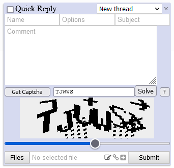

# 4chan-captcha-solver
4chan captcha solver userscript

Automatically fills in the captcha when the captcha loads. If you get a slider captcha, the slider will be moved into position automatically. If the automatic slider detection is incorrect, you can move it yourself and press the "Solve" button to redo the solution with the new position.

No error handling in place - if solving fails, you can find the reason in js console.

I can't upload it to any userscript js site because of size. Most of the size is model weights.

#### 11.07.2021
Built a new model from scratch, without using a pretrained one, on 50k synthetic samples (as opposed to previous one trained on 400 images + their augmentations).

